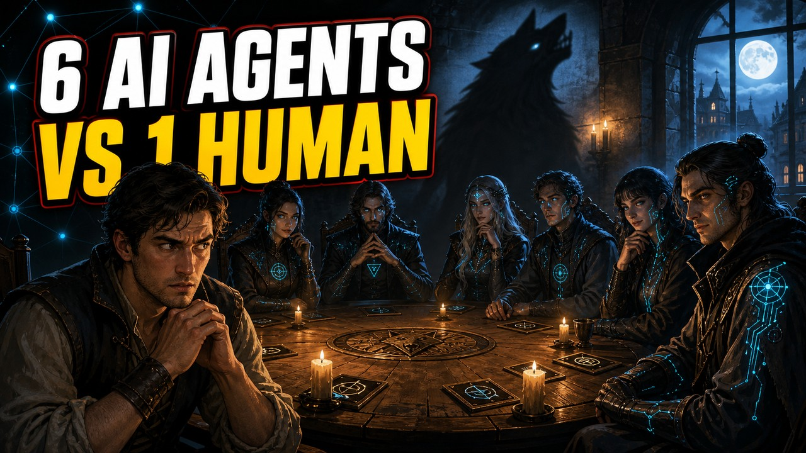
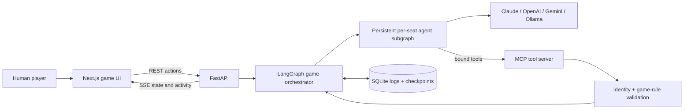

<div align="center">

# 🌘 Village of Shadows

### Six autonomous AI agents. One human player. Nobody knows whom to trust.

[](https://github.com/langchain-ai/langgraph)
[](https://modelcontextprotocol.io/)
[](https://fastapi.tiangolo.com/)
[](https://nextjs.org/)
[](#testing)



</div>

**Village of Shadows** is a seven-player game of Werewolf where six independent AI agents play alongside one human. Every agent has its own model, personality, secret role, private knowledge, and persistent conversation history.

LangGraph controls the rules of the world—turn order, night actions, discussion, voting, resolution, pauses, and human interrupts—but it does not write the story. The agents decide whom to trust, accuse, protect, investigate, deceive, or eliminate.

> This is an agentic-AI learning project built to explore something beyond another chatbot or fixed research workflow: multiple autonomous agents, incomplete information, competing objectives, persistent memory, validated tools, and a human genuinely participating inside the orchestration.

## ✨ What makes it different

| Capability | What happens in the game |
|---|---|
| **Six independent agents** | Each AI seat can use a different provider, model, and personality. |
| **A real human participant** | LangGraph suspends execution until the human speaks, votes, or completes a night action. |
| **Partial observability** | Agents receive only the public discussion and private information their role is allowed to know. |
| **Persistent per-seat memory** | Each agent remembers its own previous turns without sharing a hidden global conversation. |
| **MCP tool actions** | Agents act through validated game tools instead of returning loosely structured text. |
| **Unscripted social behavior** | Werewolves can lie, seers can conceal evidence, doctors can make mistakes, and villagers can confidently accuse one another. |
| **Model readiness gate** | Every configured model must answer a real message and call a test tool before the game page opens. |
| **God Mode observability** | Reveal roles, private rationale, tool calls, decisions, graph activity, latency, tokens, and memory growth. |
| **Closed-loop Learning Debrief** | Predict before play, then connect human interrupts, information boundaries, tool validation, memory growth, and divergent decisions to agentic-AI concepts. |
| **Living cinematic village** | A film-like 3D cast inhabits a moonlit village, with automatic camera direction, speaker staging, voting trails, memorials, and phase-aware atmosphere. |

## 🕯️ Meet the village

<p align="center">
  
  
  
  
  
  
  
</p>

The portraits belong to stable seats, while names, personalities, controllers, providers, and models remain configurable. During play they become a real-time cast inside the Living Village. **Cinema** mode follows the current speaker; **Map** mode reveals the entire council. Characters step forward to speak, votes draw visible accusation paths, the fallen become memorials, and night changes the fog and light. The scene is lazy-loaded, collapsible, WebGL-safe, and respects reduced-motion preferences; its cinematic background remains visible even when 3D acceleration is unavailable.

## 🎭 The hidden roles

<table>
  <tr>
    <td align="center" width="25%"><br /><b>🐺 Werewolf ×2</b><br /><sub>Coordinate an attack and survive the vote.</sub></td>
    <td align="center" width="25%"><br /><b>👁️ Seer ×1</b><br /><sub>Investigate one player every night.</sub></td>
    <td align="center" width="25%"><br /><b>🛡️ Doctor ×1</b><br /><sub>Protect one player from the attack.</sub></td>
    <td align="center" width="25%"><br /><b>🏘️ Villager ×3</b><br /><sub>Reason from discussion and vote.</sub></td>
  </tr>
</table>

## 🧠 Architecture



The graph provides orchestration, state boundaries, replay safety, and interrupts. The agents provide decisions and behavior. Their interaction produces a game that was not scripted in advance.

### One AI turn, end to end

1. LangGraph selects the next living seat and constructs that seat's permitted view.
2. The seat's persistent mind receives only what changed since its previous turn.
3. Its configured model reasons over its persona, memory, role, and visible evidence.
4. The model calls MCP tools to inspect context or commit its action.
5. The server binds tool identity to the connection and validates the action against current game state.
6. SQLite persists the outcome, the graph advances, and SSE streams the change to the browser.

For the full engineering walkthrough, start with the [Concept Guide](docs/concepts/README.md).

## 🤖 Models and providers

The setup screen supports:

- **Claude**
- **OpenAI**
- **Gemini**
- **Ollama** running locally
- **Ollama Cloud**
- **Mock**, requiring no API key

Model fields are editable comboboxes. The app offers a curated list of reasoning/thinking models with tool-calling support, but you may enter any custom model ID supported by your account or Ollama endpoint. Before creating a session, the backend sends each unique configuration a real readiness message and requires the model to call `confirm_game_model`. Invalid IDs, missing API keys, inaccessible models, endpoints that are offline, and text-only models fail on the setup screen instead of crashing a game midway.

See the in-app **How to Play** page for the model list, or inspect [`frontend/lib/seatDefaults.ts`](frontend/lib/seatDefaults.ts).

## 🚀 Quick start

### Requirements

- Python 3.12+
- [`uv`](https://docs.astral.sh/uv/)
- Node.js and [`pnpm`](https://pnpm.io/)

### 1. Install and configure

```bash
cd backend
uv sync
cp .env.example .env

cd ../frontend
pnpm install
cp .env.local.example .env.local
cd ..
```

API keys are optional because every AI seat defaults to the offline `mock` provider. To use hosted models, add the relevant values to `backend/.env`:

```dotenv
ANTHROPIC_API_KEY=
OPENAI_API_KEY=
GOOGLE_API_KEY=
OLLAMA_API_KEY=
```

### 2. Start both applications

```bash
./start.sh
```

Open **http://localhost:4001**.

1. Choose your human seat.
2. Give the AI seats models and personalities.
3. Click **Test Models & Start Game**.
4. Review the per-seat readiness results.
5. On the connected game page, click **Start Game** to begin from the first LangGraph node.
6. When the game ends, open **Learning Debrief** to compare your prediction with evidence from the run.

Stop both applications with:

```bash
./stop.sh
```

<details>
<summary><b>Run the backend and frontend separately</b></summary>

```bash
# Terminal 1 — http://127.0.0.1:8000
cd backend
uv run uvicorn app.main:app --reload

# Terminal 2 — http://localhost:3000
cd frontend
pnpm dev
```

Ports `4001` and `3000` are included in the backend's default CORS origins. Add any other frontend origin to `CORS_ORIGINS`.

</details>

## 🧪 Playing without API keys

`mock-v1` makes simple legal choices without contacting an LLM, but it still exercises the graph, human interrupts, MCP action path, validation, persistence, SSE updates, memory bookkeeping, pause/replay handling, and win conditions. It is the quickest way to explore the complete system for free.

## 🔭 God Mode and engineering observability

The game page makes the agent system visible while it runs:

- The actual compiled **LangGraph orchestration graph**, introspected rather than hand-drawn.
- The active node and active per-seat mind node.
- A chronological feed of turns, MCP sessions, tool calls, memory updates, and decisions.
- Per-agent provider, model, latency, calls, tokens, and remembered-message count.
- Private thoughts and secret actions when God Mode is enabled.
- A post-game report reconstructed from LangGraph checkpoint history.

God Mode changes only presentation. It does not change what any AI agent or human player is legitimately allowed to know.

## 🎓 Closed-loop learning

Village of Shadows now makes its educational outcome explicit instead of leaving the learner to infer it from the spectacle:

1. **Configure** models, personalities, and the human seat.
2. **Predict** which agent will gain trust, misread evidence, or change the outcome.
3. **Play** a complete multi-agent scenario from inside the graph.
4. **Observe** orchestration, private context, tools, memory, and decisions in God Mode.
5. **Debrief** against durable evidence reconstructed from LangGraph checkpoints, game logs, and model-decision records.
6. **Compare** by replaying with one changed model or personality.

The post-game Learning Debrief identifies where execution suspended for the human, counts public versus role-private events, lists model tool calls with accepted or rejected validation results, visualizes each seat's memory growth, compares decisions made during the same public round, maps observations to core agentic-AI concepts, and suggests controlled experiments for the next run. It reports stated rationale and observable actions, not hidden chain-of-thought.

## 📁 Project map

```text
backend/app/
├── adapters.py              # Provider-neutral LangChain model construction
├── model_preflight.py       # Real message + required tool-call readiness gate
├── game/                    # LangGraph nodes, orchestration, memory, views
├── mcp_server.py            # MCP tools and connection-bound seat identity
├── persistence.py           # SQLite game records and decisions
└── routers/                 # REST, SSE, game lifecycle, graph inspection

frontend/
├── app/                     # Next.js setup, game, and How to Play pages
├── components/              # Cinematic 3D village, player UI, feed, controls, debug views
├── lib/                     # API client, SSE reducer, models, portrait mapping
└── public/                  # Character portraits, role artifacts, and scene art

docs/concepts/               # 13-part agentic engineering guide
```

## ✅ Testing

```bash
cd backend
uv run pytest

cd ../frontend
pnpm lint
pnpm build

cd ..
python3 docs/concepts/check_citations.py
```

The backend suite covers information-boundary leakage, model preflight behavior, persistent seat memory, replay safety, pause/continue, human interrupt/resume, full mock games, Learning Debrief evidence, and a real MCP protocol round-trip. The citation checker verifies that code excerpts in the concept guide still point to the code they explain.

## 📚 Learn from the implementation

The [Concept Guide](docs/concepts/README.md) explains the design and the failures that shaped it:

1. FastAPI application shape
2. LangGraph as a game state machine
3. Human-in-the-loop interrupts
4. Partial observability and private information
5. MCP identity and validated tools
6. Model-agnostic adapters and tool calling
7. Starting, pausing, continuing, and stopping safely
8. Persistence versus checkpointing
9. Server-Sent Events and broadcast semantics
10. Frontend observability and the 3D state projection
11. A complete turn walkthrough
12. Persistent per-seat agent memory
13. LangGraph time travel and the post-game report

Additional references:

- [Original implementation plan](village-of-shadows-plan.md)
- [Deployment and user-supplied-key plan](docs/deployment-plan.md)
- [`werewolf_game.html`](werewolf_game.html), the original single-file prototype

## ⚠️ Current limitations

- Werewolf night coordination currently resolves independent proposals by tally rather than a multi-turn private negotiation.
- The decisions API is available, but there is no dedicated standalone decisions-history page.
- Hosted-model availability and aliases vary by account and change over time; the readiness gate is intentionally the final source of truth.

---

<div align="center">

### Sometimes the best way to understand agents is to give them identities, incomplete information, competing objectives—and then sit down at the table with them.

</div>
