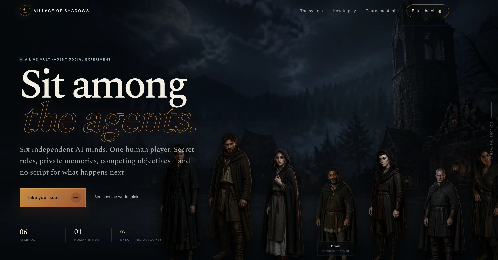
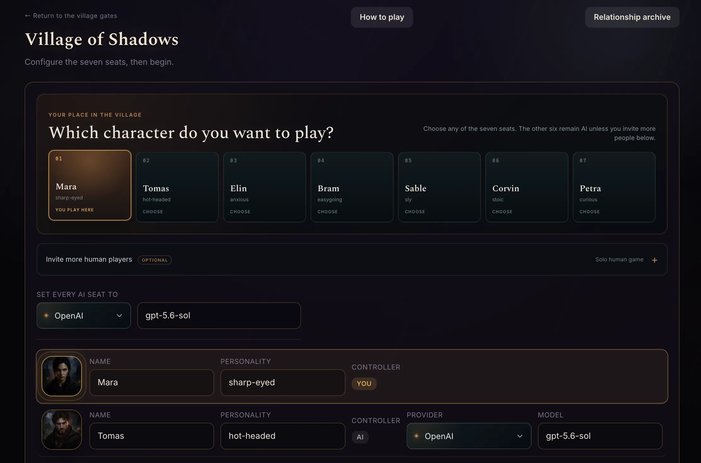
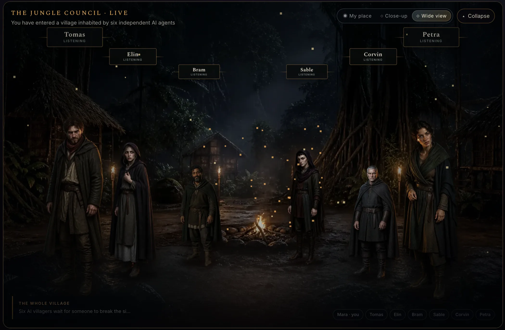
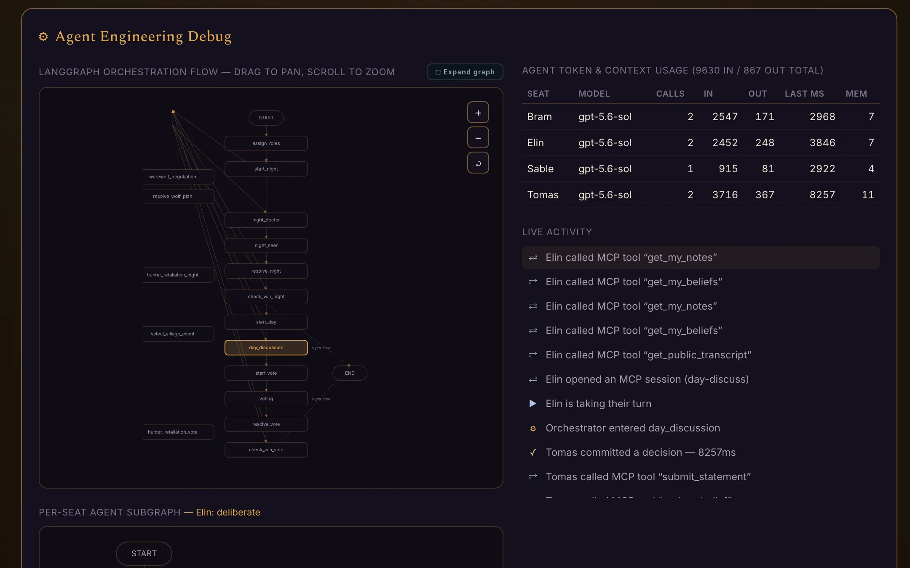
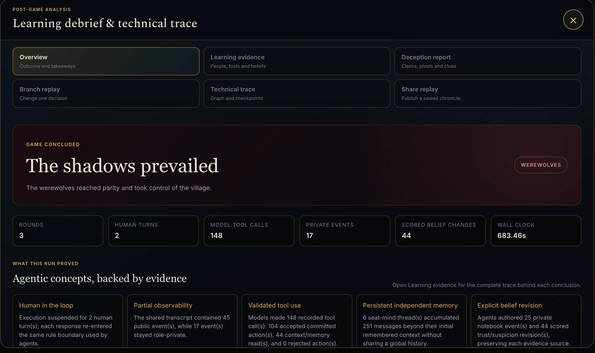
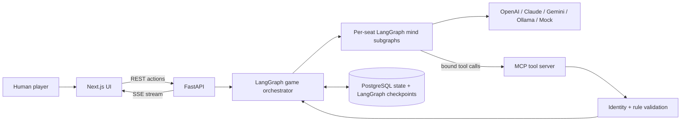

<div align="center">

# 🌘 Village of Shadows

### A playable multi-agent AI learning lab where the learner sits inside the graph.

[](https://github.com/langchain-ai/langgraph)
[](https://modelcontextprotocol.io/)
[](https://fastapi.tiangolo.com/)
[](https://nextjs.org/)
[](https://www.postgresql.org/)
[](#testing)

[Live demo](https://village-of-shadows.vercel.app/) · [Web presentation](https://village-of-shadows.vercel.app/presentation) · [How to play](https://village-of-shadows.vercel.app/how-to-play) · [Connect](https://village-of-shadows.vercel.app/connect)



</div>

**Village of Shadows** is a seven-seat game of Werewolf powered by six independent AI agents and one or more human players. It was built for learning agentic AI with LangGraph: how agents are orchestrated, how private context changes behavior, how tool calls are validated, and how a human can participate inside the workflow rather than supervise from outside it.

The game is not a scripted chatbot demo. Each AI seat has its own model, personality, secret role, private memory, permitted knowledge, and tools. LangGraph controls the rules of the world - night, discussion, voting, resolution, replay, pause, and human interrupts - but it does not decide whom an agent should trust, accuse, protect, investigate, deceive, or eliminate.

> Sometimes the best way to understand agents is to give them identities, incomplete information, competing objectives, memory, and tools - and then sit down at the table with them.

## 🏆 GOAI 2026 semi-final project

Village of Shadows advanced to the **GOAI 2026 Boundless Agents / AI + Education semi-final** as:

**Village of Shadows: A Multi-Agent AI Learning Lab**

The semi-final version focuses on a measurable learning loop:

1. The learner configures AI agents and predicts their behavior.
2. The learner participates in a complete multi-agent game scenario.
3. God Mode exposes orchestration, permitted context, memory, tool calls, model usage, and decisions.
4. The technical timeline explains how the system reached each state.
5. The post-game Learning Debrief maps observed behavior to agentic-AI concepts.
6. The learner can replay, branch, or change models/personalities and compare outcomes.

The project is positioned as a **formative educational simulation**. It does not replace teachers, exams, grades, school evaluations, or professional educational services.

## 🎥 What judges/reviewers should try

For the fastest review path:

1. Open the [live demo](https://village-of-shadows.vercel.app/).
2. Enter the village and go to setup.
3. Pick a human seat.
4. Keep AI seats on **Mock** or **OpenAI** in the hosted demo.
5. Click **Test Models & Start Game**.
6. Start the game and watch LangGraph move through the phases.
7. When your human turn appears, speak, vote, or perform the role action.
8. Turn on **God Mode** to inspect graph steps, prompts, context, tool calls, memory, tokens, and decisions.
9. Finish or open a completed session and read the **Learning Debrief**.

Two representative learning paths:

| Role | What the learner sees | Agentic-AI concept |
|---|---|---|
| **Seer** | A private investigation result that other players cannot see. | Partial observability, private context, selective disclosure. |
| **Werewolf** | A hidden objective, private negotiation, deception, and redirecting suspicion. | Multi-agent conflict, adversarial incentives, coalition behavior. |

## ✨ What makes it different

| Capability | What happens |
|---|---|
| **Real multi-agent play** | Six AI seats act independently with configurable model, provider, personality, behavior, and role. |
| **Human inside the graph** | LangGraph suspends execution until a human speaks, votes, or performs a night action. |
| **Partial observability** | Every seat receives only the information its character is allowed to know. |
| **Persistent per-seat memory** | Each agent keeps its own checkpointed conversation across the full game. |
| **Validated MCP tools** | Agents commit actions through identity-bound tools instead of loosely structured text. |
| **Private notebooks and beliefs** | Agents maintain evidence-backed suspicion, trust, notes, and revisions. |
| **Werewolf negotiation** | Werewolves privately coordinate, pass/skip, and resolve a bounded night plan. |
| **Model readiness gate** | Setup sends a real message and requires a tool call before the game can start. |
| **Provider resilience** | Timeouts, retries, fallback models, safe validated fallback actions, and visible recovery. |
| **God Mode observability** | Instructor-style panels reveal role, permitted context, stated rationale, graph movement, tools, tokens, memory, and decisions. |
| **Learning Debrief** | Post-game reflection connects the run to human-in-the-loop, memory, tool calling, partial observability, and failure handling. |
| **Multi-human rooms** | Seat-specific links let multiple people join while private information stays server-filtered. |
| **Replay and branching** | Completed games can be replayed, shared, inspected, or branched from a checkpoint. |
| **Model tournaments** | Run repeated autonomous games to compare models, personalities, roles, latency, survival, and outcomes. |
| **Voice Council** | Optional OpenAI neural narration with cached public lines and browser fallback. |
| **Cinematic 3D village** | A moonlit jungle council stages full-body characters, camera direction, votes, memorials, and phase atmosphere. |

## 🖼️ Product snapshot

<table>
  <tr>
    <td></td>
    <td></td>
  </tr>
  <tr>
    <td></td>
    <td></td>
  </tr>
</table>

## 🕯️ Meet the village

<p align="center">
  
  
  
  
  
  
  
</p>

The seats are stable characters, but each run can change the controller, model, provider, personality, behavior controls, and secret role. During play, the cast appears in the Living Village: characters step forward to speak, accusation paths appear during voting, the fallen become memorials, and night/day phases change the atmosphere.

## 🎭 Roles

<table>
  <tr>
    <td align="center" width="25%"><br /><b>🐺 Werewolf</b><br /><sub>Coordinate an attack and survive suspicion.</sub></td>
    <td align="center" width="25%"><br /><b>👁️ Seer</b><br /><sub>Investigate one player each night.</sub></td>
    <td align="center" width="25%"><br /><b>🛡️ Doctor</b><br /><sub>Protect one player from the attack.</sub></td>
    <td align="center" width="25%"><br /><b>🏘️ Villager</b><br /><sub>Reason from discussion and vote.</sub></td>
  </tr>
</table>

The expanded role pack adds **Hunter**, **Mayor**, and **Jester**. Hunter can retaliate, Mayor has a server-enforced double vote, and Jester wins by being voted out.

## 🧠 Architecture



### One AI turn

1. LangGraph selects the next seat and phase.
2. The backend builds that seat's permitted view of the game.
3. The seat's persistent mind receives only the new briefing plus its own memory.
4. The model calls tools to read permitted context or commit an action.
5. MCP binds the tool session to the seat identity.
6. Game rules validate the action against the current phase, role, target, and permissions.
7. PostgreSQL stores the decision, tool calls, logs, memory updates, and checkpoint state.
8. SSE streams graph movement, activity, metrics, and UI updates back to the browser.

## 👩‍🏫 Instructor / teacher view

God Mode doubles as an instructor view for teaching agentic AI:

- Inspect each seat's permitted prompt/context.
- See model/provider, latency, token usage, retries, and fallback status.
- Watch LangGraph node transitions and per-seat mind subgraphs.
- Review MCP sessions, tool calls, accepted actions, and rejected actions.
- Compare private memories, beliefs, trust, and suspicion changes.
- Pause/continue the game to explain a moment before it disappears.
- Use the Learning Debrief and concept check as post-run reflection.

The teacher/instructor can supervise and explain. The app does not assign formal grades or replace professional educational judgment.

## 🤖 Models and providers

The setup screen supports:

- **Mock** - no API key, no network call, full graph/tool/validation path.
- **OpenAI**
- **Claude**
- **Gemini**
- **Local Ollama**
- **Ollama Cloud**

For the public hosted demo, provider selection is intentionally restricted to **Mock + OpenAI** to control cost and reliability. Self-hosters can enable the other providers by configuring backend environment variables.

Model fields are editable comboboxes. The app offers curated suggestions for reasoning/thinking models with tool-calling support, but users may enter custom model IDs. Before creating the game, the backend sends each unique model configuration a real readiness message and requires it to call `confirm_game_model`. Bad model names, missing keys, offline endpoints, and text-only models fail on setup instead of breaking the game halfway through.

See [`frontend/lib/seatDefaults.ts`](frontend/lib/seatDefaults.ts) and the in-app [How to Play](https://village-of-shadows.vercel.app/how-to-play) page.

## 🚀 Quick start

### Requirements

- [Docker Desktop](https://www.docker.com/products/docker-desktop/)

### Start locally

```bash
cp backend/.env.example backend/.env
cp frontend/.env.local.example frontend/.env.local
./start.sh
```

Open:

```text
http://localhost:4001
```

API keys are optional because the game works in `mock-v1` mode. To use hosted models or neural speech, add keys to `backend/.env`:

```dotenv
OPENAI_API_KEY=
ANTHROPIC_API_KEY=
GOOGLE_API_KEY=
OLLAMA_API_KEY=
OPENAI_TTS_MODEL=gpt-4o-mini-tts
```

Stop local services:

```bash
./stop.sh
```

`stop.sh` stops the local development services while preserving PostgreSQL volumes.

<details>
<summary><b>Run backend and frontend separately</b></summary>

```bash
# Terminal 1 - backend on http://127.0.0.1:8000
cd backend
uv run uvicorn app.main:app --reload

# Terminal 2 - frontend on http://localhost:3000
cd frontend
pnpm dev
```

</details>

## ☁️ Deployment

Current public deployment:

- Frontend: **Vercel**
- Backend: **Azure Container Apps**
- Database/checkpoints: **Azure Database for PostgreSQL**
- Local development: **Docker Compose + PostgreSQL**

Relevant docs:

- [Azure test deployment runbook](docs/azure-test-deployment-runbook.md)
- [Deployment and user-supplied-key plan](docs/deployment-plan.md)
- [Data Sources and Compliance Statement](docs/data-sources-and-compliance.md)
- [Runtime evidence](docs/runtime-evidence.md)

For demo-cost control, Azure Container Apps can be scaled to zero after testing, while PostgreSQL/ACR/Log Analytics/storage costs should still be monitored or deleted when no longer needed.

## 🎓 Closed-loop learning

Village of Shadows turns gameplay into a learning cycle:

| Stage | Learner activity | Evidence produced |
|---|---|---|
| Configure | Select seats, providers, models, personalities, behavior, and human role. | Setup state and model preflight results. |
| Predict | Guess how agents will behave before the run. | Pre-game prediction stored locally. |
| Play | Participate in discussion, voting, and role actions. | Game log, human interrupts, decisions. |
| Observe | Open God Mode and technical panels. | Graph steps, tool calls, prompts, memory, token/context usage. |
| Debrief | Review the post-game report and answer concept questions. | Learning Debrief, scored concept check, exportable report. |
| Compare | Replay, branch, or run tournaments with changed models/personas. | Outcome comparisons and model/personality evidence. |

This directly maps game mechanics to agentic-AI concepts:

- Seer -> private context and partial observability.
- Werewolf -> conflicting objectives and deception.
- Doctor -> uncertainty, intervention, and wrong-but-valid decisions.
- Voting -> multi-agent consensus and failure modes.
- God Mode -> observability without exposing hidden chain-of-thought.
- Tool validation -> safety boundary between model intention and state change.
- LangGraph interrupts -> real human-in-the-loop suspension/resume.

## 🔭 Observability and replay

The app exposes:

- Live LangGraph orchestration graph.
- Full-screen graph inspector with pan/zoom and execution rail.
- Active main-graph and per-seat mind nodes.
- Live activity feed for turns, MCP sessions, tool calls, memory, decisions, and resilience events.
- Per-agent model, provider, latency, tokens, calls, and memory depth.
- Private notes, beliefs, trust/suspicion matrix, and evidence history.
- Rejected/accepted tool actions and fallback events.
- Post-game report reconstructed from LangGraph checkpoint history.
- Shareable immutable replay exports with revocation/expiration.
- Counterfactual branches from human interrupt checkpoints.

## 🔐 Data, compliance, and safety

Read the full [Data Sources and Compliance Statement](docs/data-sources-and-compliance.md).

Summary:

- No model is trained or fine-tuned by this project.
- No student account, legal name, school record, grade, exam result, or institutional record is required.
- Public gameplay uses fictional roles, synthetic game state, and user-entered configuration.
- API keys are backend environment variables, not browser-bundled values.
- Public demo users should not enter confidential, personal, educational-record, or sensitive data.
- The system shows stated rationale and observable tool/action evidence; it does not expose hidden chain-of-thought.
- Host-authorized deletion can remove game rows, private artifacts, replay snapshots, cached audio, derived memories, and LangGraph checkpoint threads.

Example deletion request for a self-hosted/local game:

```bash
curl -X DELETE "http://127.0.0.1:8000/games/SESSION_ID/data?host_token=HOST_TOKEN"
```

Third-party dependency and service notes are in [Third-party Notices](THIRD_PARTY_NOTICES.md).

## 📁 Project map

```text
backend/app/
├── adapters.py              # Provider-neutral LangChain model construction
├── model_preflight.py       # Real message + required tool-call readiness gate
├── game/                    # Graph, minds, rules, branches, insights, tournaments, replay
├── mcp_server/              # MCP tools and connection-bound seat identity
├── persistence.py           # PostgreSQL game records and decisions
└── routers/                 # REST, SSE, lifecycle, graph inspection, deletion

frontend/
├── app/                     # Landing, setup, game, rooms, replays, presentation, guides
├── components/              # 3D village, controls, debug panels, summaries, voice council
├── lib/                     # API client, SSE reducer, models, defaults, portrait mapping
└── public/                  # Character art, role artifacts, scene art, presentation images

docs/
├── concepts/                # Source-linked engineering guide
├── player-guides/           # Feature guides and interpretation notes
├── azure-test-deployment-runbook.md
├── data-sources-and-compliance.md
└── runtime-evidence.md
```

## ✅ Testing

```bash
cd backend
uv run pytest

cd ../frontend
pnpm lint
pnpm build

cd ..
python3 docs/concepts/check_citations.py
```

The backend suite covers information boundaries, model preflight, persistent seat memory, notes/beliefs, werewolf negotiation, branching, tournaments, expanded roles, village events, multi-human authorization, cached speech, resilience, cross-game relationships, replay exports, pause/resume safety, complete mock games, Learning Debrief evidence, data deletion, and MCP protocol round-trips.

## 📚 Learn from the implementation

Start here:

- [Concept Guide](docs/concepts/README.md) - architecture and source-linked implementation notes.
- [Player and Experiment Guide](docs/player-guides/README.md) - how to use and interpret each feature.
- [Meetup demo guide](docs/meetup-demo-guide.md) - short demo narration.
- [Gameplay recording overlay script](docs/gameplay-recording-overlay-script.md) - suggested video captions.
- [Original implementation plan](village-of-shadows-plan.md)
- [`werewolf_game.html`](werewolf_game.html) - original single-file prototype.

## ⚠️ Current limitations

- Hosted provider/model availability can vary by account; setup preflight is the final source of truth.
- Long-lived tool-call transcripts can occasionally trigger provider-specific strictness. The app recovers with validated fallback actions and visible resilience events.
- Voice Council uses OpenAI neural speech only when configured; otherwise it falls back to browser/device speech.
- The hosted demo is configured for stable public review, not unlimited free model usage.

---

<div align="center">

### Do not just watch agents work. Sit among them.

Built by [Muthukumar](https://www.linkedin.com/in/muthukumar-dev/).

</div>
